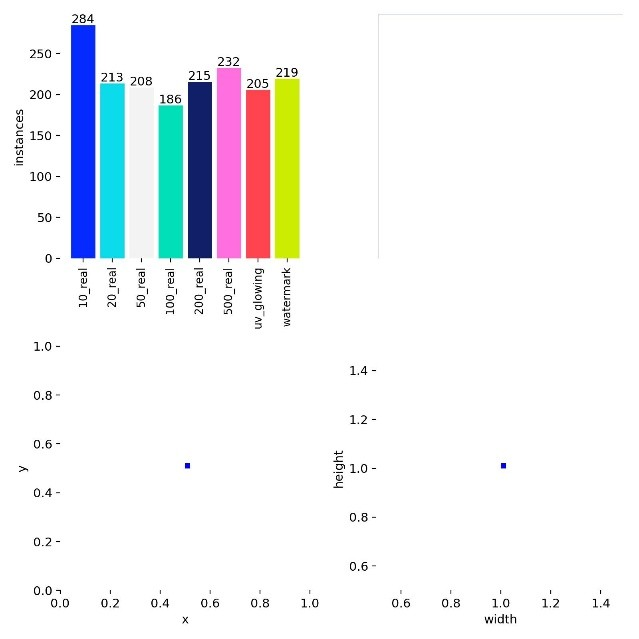
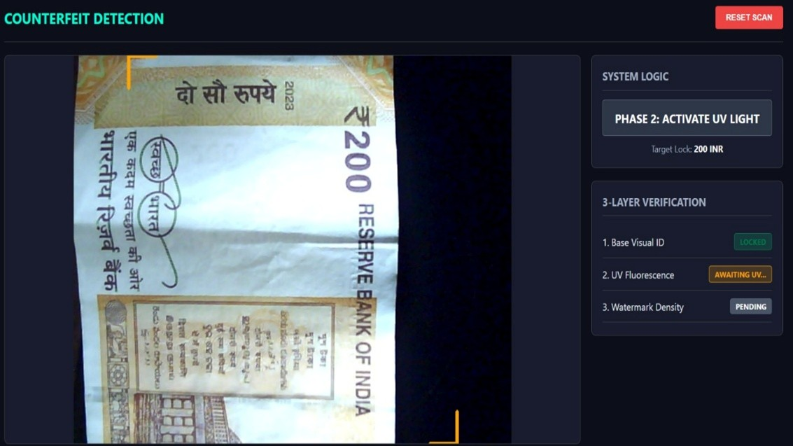
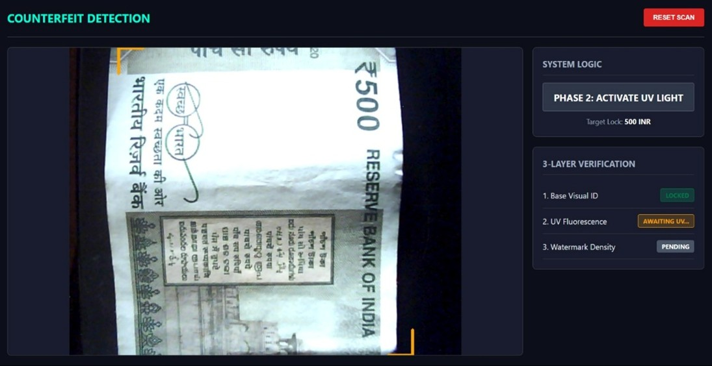
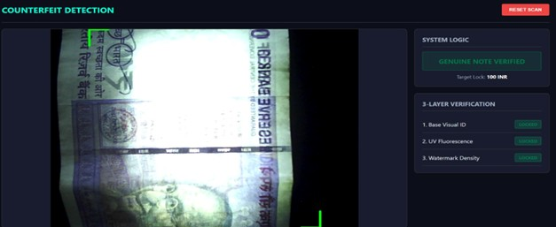

# AI Counterfeit Currency Detection System

## Overview
This project is an AI-powered counterfeit currency detection system built using Python, FastAPI, TensorFlow, and OpenCV. The system analyzes uploaded currency images and predicts whether the note is genuine or counterfeit using computer vision and deep learning techniques.

The application is designed to support real-time prediction workflows with a scalable backend architecture and API-driven processing pipeline.

---

## Problem Statement
Counterfeit currency circulation creates financial and security challenges. Manual verification methods are often slow and unreliable. This project aims to provide an automated AI-based solution for detecting counterfeit currency notes efficiently using image analysis and machine learning.

---

## Features
- AI-powered counterfeit currency detection
- FastAPI backend for real-time API processing
- Image preprocessing using OpenCV
- TensorFlow-based prediction pipeline
- REST API integration
- Scalable backend architecture
- Real-time prediction responses
- Modular and maintainable code structure

---

## Tech Stack

### Backend
- Python
- FastAPI

### AI / Computer Vision
- TensorFlow
- OpenCV

### Database / Storage
- MongoDB (if used)

### Tools
- Git
- GitHub
- VS Code

---

## System Architecture

```text
User Upload → FastAPI Backend → Image Preprocessing → TensorFlow Model → Prediction Response

## Results

### Counterfeit Device


### Graph


### Picture2


### Picture3


### Picture4
